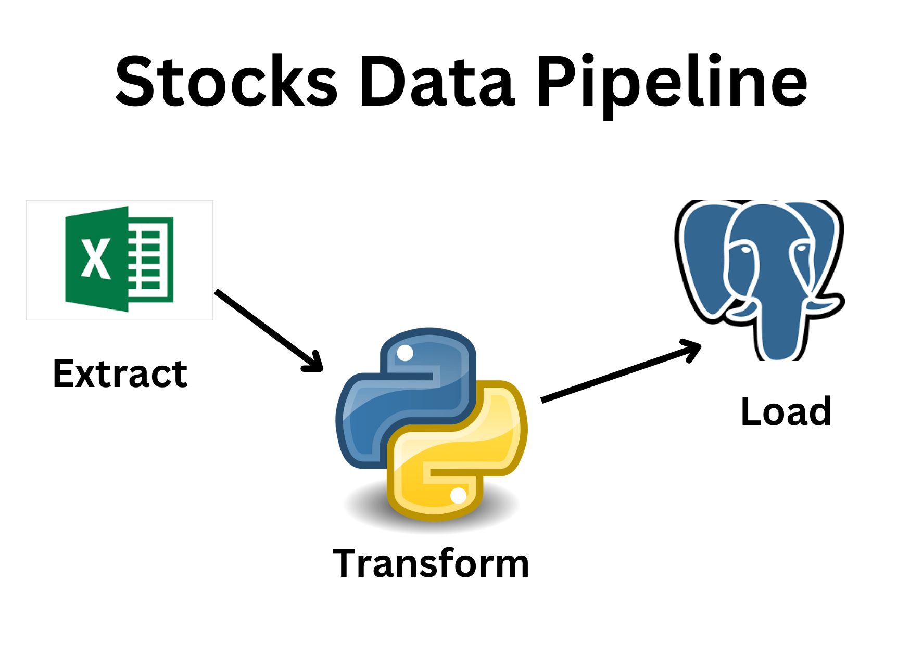

<!-- PROJECT LOGO -->
<br />
<div align="center">
  <a href="https://github.com/WaliiyaRizwan/Stock-Data-Pipeline">
    
  </a>

  <h3 align="center">Stocks Data Pipeline</h3>
  
</div>


<!-- ABOUT THE PROJECT -->
### About The Project

The Stock Data Pipeline project is a data pipeline designed to collect, clean, and analyze stock market data. The project consists of several scripts that automate the data collection process, clean and preprocess the data, load the data into a PostgreSQL database, and perform data analysis. This project aims to provide a convenient and efficient way to collect and analyze stock market data, which can be used for various purposes such as investment decisions, trend analysis, and financial research.

### Step by Step

1. **Data Source**: I started with a CSV file containing historical stock data that I downloaded from the internet.


2. **Extract-Transform-Load (ETL)**: Using Python, I applied ETL techniques to process the data. This involved extracting the data from the CSV file, transforming it using Pandas to clean and preprocess it, and then loading the cleaned data into a PostgreSQL database.

3. **Database**: I created a PostgreSQL database to store the cleaned data. This involved setting up a table to hold the data and establishing a connection between my Python script and the database.

4. **Data Loading**: Finally, I loaded the cleaned data into the PostgreSQL database using a Python library called psycopg2.


### Prerequisites

For this project you need these to be installed
* pip
  ```sh
  pip install psycopg2 | pandas | numpy
  ```
  
 * Postgresql
 
 * Python


<!-- LICENSE -->
## License

Distributed under the MIT License. See `LICENSE.txt` for more information.


<!-- CONTACT -->
## Contact

Waliiya Rizwan - [@Waliiya Rizwan](https://www.linkedin.com/in/waliiya-rizwan-4b3b411b9/)

Project Link: [[https://github.com/WaliiyaRizwan/Stock-Data-Pipeline/Stocks_Data_Pipeline.ipynb](https://github.com/WaliiyaRizwan/Stock-Data-Pipeline/blob/main/Stocks_Data_Pipeline.ipynb)]([https://github.com/WaliiyaRizwan/Stock-Data-Pipeline/Stocks_Data_Pipeline.ipynb](https://github.com/WaliiyaRizwan/Stock-Data-Pipeline/blob/main/Stocks_Data_Pipeline.ipynb))


